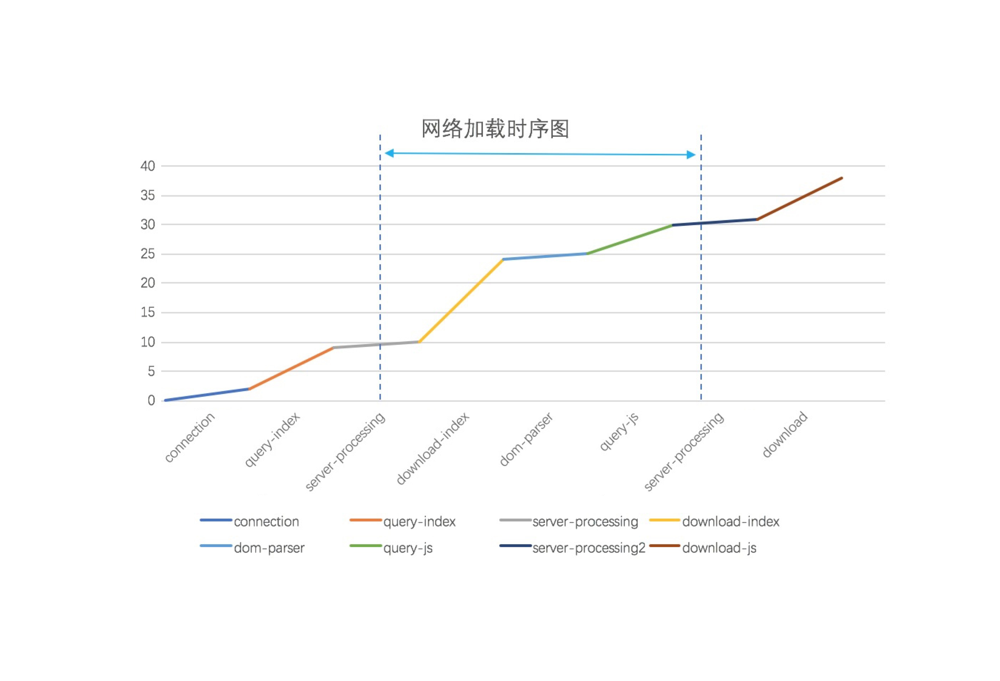

## 测量资源加载时间

``` html 
<html>
<head>
    <script type="text/javascript" src="speed.js?rt=${server_time}"></script>
    ... 
</head>
<body>
    ... 
</body>
</html>
```



### 启动
```
$ nohup node speed.js --host=127.0.0.1 --port=9099 >/dev/null 2>&1 & 
```

### 重启

```
$ netstat -nltp | grep :9099
tcp        0      0 127.0.0.1:9099              0.0.0.0:*                   LISTEN      5082/node 
$ kill -2 5082
$ nohup node speed.js --host=127.0.0.1 --port=9099 >/dev/null 2>&1 & 
```
